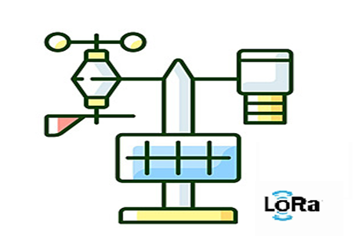
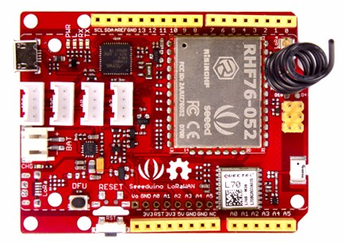
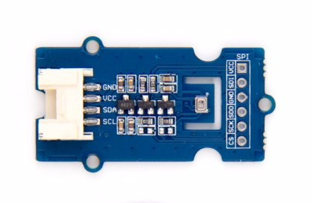
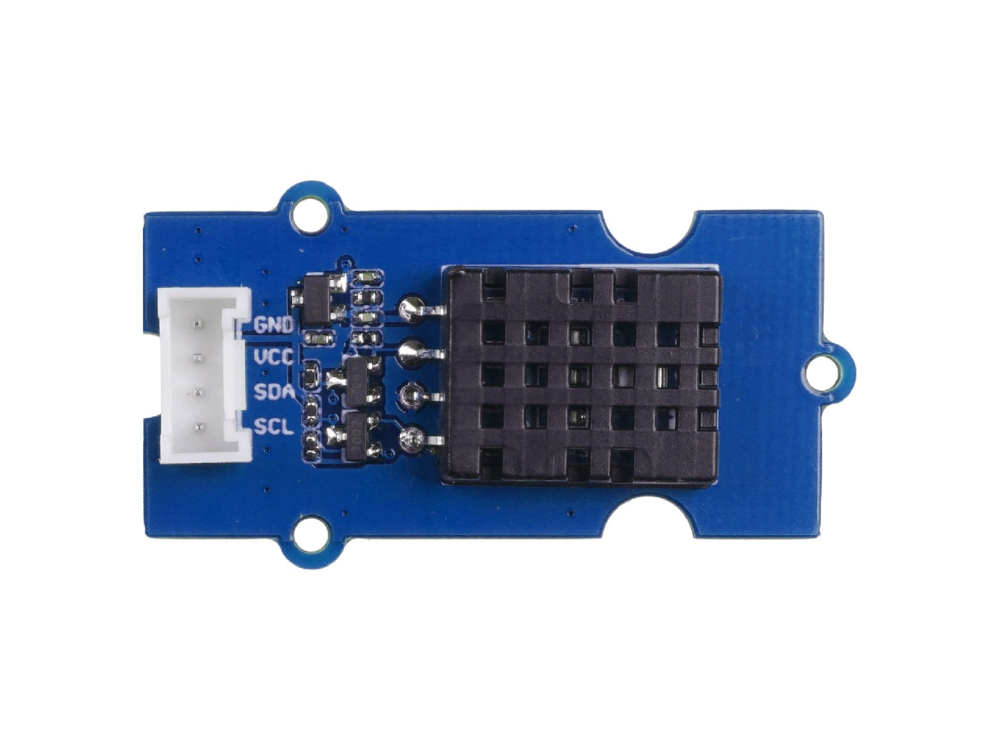

    

  
<h1 align="center">LoRa Weather Station Project</h1>
<h2>Table of Contents</h2>
<ol>
    <li><a href="#introduction">Introduction</a></li>
    <li><a href="#hardware">Hardware</a></li>
    <li><a href="#software">Software</a></li>
    <li><a href="#IDEA-libraries-installation">IDE and Libraries Installation</a></li>
    <li><a href="#sensor-module">Sensor Module</a></li>
    <li><a href="#Lora Interface">Lora Interface</a></li>
    <li><a href="#requirements">Requirements</a></li>
</ol>
  
<h2 id="introduction">Introduction</h2>

    The goal of this project is to develop a weather station based on Seeeduino LoRaWAN W/GPS, capable of collecting environmental data such as temperature, humidity, atmospheric pressure, and other information. 
    It uses LoRa technology, which has the significant advantage of wireless connectivity over long distances with low power consumption. 
    This allows for long-distance transmission of data via LoRa to the TTN server, where the data will be processed and visually displayed remotely.

  
<h2 id="hardware">Hardware</h2>

 
    
    <figcaption>Hardware used in the project, For more information, click the link
    <a href="https://wiki.seeedstudio.com/Seeeduino_LoRAWAN/" target="_blank">Wiki Seeedstudio.</a>
      </figcaption>

  
<h2 id="software">Software</h2>
<ul>
    <li> Arduino IDE;</li>
    <li> Arduino libraries for sensor integration;</li>
    <li>Sensor Module (Contains the script and tests for collecting environmental data from the sensors);</li>
    <li>LoRa Interface (Contains the script responsible for LoRaWAN communication and data transmission);</li>
</ul>
  
<h2 id="IDEA-libraries-installation">IDE and Libraries Installation</h2>

    <strong>Arduino IDE setup:</strong> 
    Here are a few quick steps:
  

  
  <ol>
    <li>Download the latest version of Arduino IDE: 
      <a href="https://www.arduino.cc/en/software" target="_blank">Download from the official website.</a>
    </li>
    <li>Install the Seeedstudio driver (necessary for the Seeeduino LoRaWAN board). 
      You can follow the instructions on the 
      <a href="https://wiki.seeedstudio.com/Seeeduino_LoRAWAN/" target="_blank">Seeedstudio Wiki</a>, under "Install the Driver (For Windows)".
    </li>
    <li>Open Arduino IDE and configure the board settings.</li>
    <li>Set the correct board and port in the IDE.</li>
  </ol>  

    <strong>Installing Libraries in Arduino IDE:</strong> 
    To install the libraries, follow these steps:

<ol>
    <li> Open Arduino IDE;</li>
    <li> Navigate to Sketch -> Include Library -> Add.ZIP Library...;</li>
    <li> Select the .zip file from libs/external and libs/custom;</li>
    <li> The libraries will now be available;</li>
</ol>    

    The libs/ folder stores all libraries used in the project, divided into:

    
<ul>
    <li>external/ -> Contains external libraries;</li>
    <li>custom/ -> Includes custom libraries developed for this project to improve sensor integration;</li>
</ul>
<h2 id ="sensor-module">Sensor Module</h2>

  
The sensor module was developed to collect and analyze environmental data using the BMP280, DHT20 and GPS sensors. 
  It is structured into different folders for better organization and ease of use.

  Module Structure is organized as follows:

<pre>
tests/                      # Main folder for the tests
    sensors/                # Main folder for the sensor project
        main/               # Main folder containing the main test script
                                -> Testing each sensor individually;
                                -> Combine and test the sensors simultaneously, as well as the sensor readings, to verify proper integration;
        screenshots/        # Folder for all screenshots
            all_sensors/        # Screenshots for all sensors combined
            BMP280/             # Screenshots for BMP280 tests  <a href="https://wiki.seeedstudio.com/Grove-Barometer_Sensor-BMP280/" target="_blank">Wiki Seeedstudio BMP280</a>
                                -> Modes, Standby, Oversampling, Pressure and Temperature readings;
            DHT20/              # Screenshots for DHT20 tests  <a href="https://wiki.seeedstudio.com/Grove-Temperature-Humidity-Sensor-DH20/" target="_blank">Wiki Seeedstudio DHT20</a>
                                -> Temperature and Humidity readings;
</pre>    
<h2 id="Lora Interface">Lora Interface</h2>
  

  

<h2 id="Requirements">Requirements</h2>
<ul>
    <li> Arduino IDE to compile and upload the code;</li>
    <li> Necessary libraries (found in the libs/ folder) to install for their use;</li>
</ul>                
  
  
